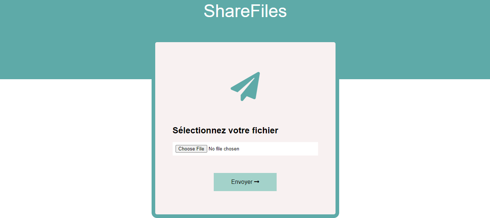

# ShareFiles - Hébergez gratuitement vos images et en illimité

## Présentation du projet

ShareFiles est une plateforme simple et intuitive qui vous permet de partager facilement vos images sur Internet. Grâce à son interface conviviale, vous pouvez uploader vos photos et les rendre accessibles en ligne sans aucune complexité technique.

## Table des Matières

- [Fonctionnalités Clés](#fonctionnalités-clés)
- [Prérequis](#prérequis)
- [Installation](#installation)
- [Utilisation](#utilisation)
- [Conclusion](#conclusion)

## Fonctionnalités Clés

- **Upload d'Images**: Téléchargez vos images directement depuis votre appareil.
- **Formats Supportés**: PNG, GIF, JPG, JPEG.
- **Taille Max**: Jusqu'à 3 Mo par image.
- **Visualisation Instantanée**: Votre image est affichée immédiatement après l'upload.
- **Lien de Partage**: Obtenez un lien unique pour partager votre image.

## Prérequis

- Un serveur web compatible avec PHP (XAMPP, ...)
- Accès à un répertoire accessible publiquement via HTTP pour stocker les images (`uploads/`).

## Installation

1. **Cloner le dépôt** : Clonez ce dépôt dans le dossier racine de votre serveur web.
   `git clone https://github.com/adelamare-blockchain/PHP8_ShareFiles.git`

2. **Configuration** : Assurez-vous que le répertoire `uploads/` existe dans le même dossier que `index.php`. Ce répertoire sera utilisé pour stocker les images uploadées.

3. **Accès :** Visitez `http://localhost/index.php` depuis un navigateur web pour commencer à utiliser ShareFiles.

## Utilisation

1. **Upload d'une Image** :

   - Cliquez sur le bouton "Sélectionnez votre fichier".
   - Choisissez l'image à partir de votre ordinateur.
   - Cliquez sur "Envoyer".

2. **Partager l'Image** :
   - Une fois l'image uploadée, un lien de partage sera généré automatiquement.
   - Copiez ce lien et partagez-le comme vous le souhaitez.

## Conclusion

Avec ShareFiles, partager vos images devient un jeu d'enfant. Sa simplicité et sa facilité d'utilisation en font une solution idéale pour tous vos besoins de partage d'images en ligne.
